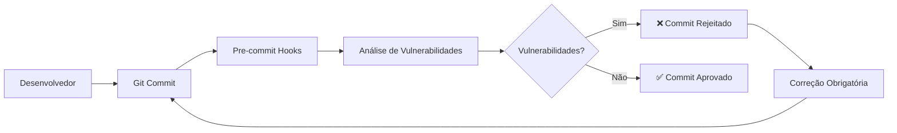

# Vollmed Java Web Application - Sistema Completo com Shift-Left Security

Este projeto é uma aplicação web completa desenvolvida em Java com Spring Boot, que simula um sistema de gerenciamento médico com agendamento de consultas. O sistema oferece uma **interface moderna e responsiva** para gerenciar médicos, consultas e usuários, implementando uma **arquitetura de segurança robusta** com **vulnerabilidades educacionais intencionais** para demonstrar práticas de **Shift-Left Security**.

## ✨ Funcionalidades Principais

### 🔐 **Sistema de Autenticação Completo**
- **Login seguro** com validação de credenciais
- **Registro de novos usuários** com criptografia BCrypt
- **Logout com confirmação** para maior segurança
- **Autenticação baseada em banco de dados** com Spring Security

### 👨‍⚕️ **Gerenciamento de Médicos**
- Cadastro completo de médicos com validações
- Listagem paginada com busca e filtros
- Edição e exclusão de registros
- Gerenciamento de especialidades médicas

### 📅 **Sistema de Consultas**
- Agendamento de consultas por especialidade
- Seleção automática de médicos disponíveis
- Controle de data/hora com validações
- Gestão completa do histórico de consultas

### 🎨 **Interface Moderna e Responsiva**
- **Design glassmorphism** com gradientes azuis
- **Efeitos visuais modernos** (hover effects, sombras, transições)
- **Totalmente responsivo** (mobile-first design)
- **Experiência de usuário otimizada** com validações em tempo real

## 🛡️ **Arquitetura de Segurança e DevSecOps**

### 🚀 **Shift-Left Security Strategy**

Este projeto implementa uma **estratégia completa de Shift-Left Security**, movendo a segurança para o início do ciclo de desenvolvimento:

#### **Pipeline de Segurança Automatizado**


#### **Ferramentas de Segurança Integradas**
- 🔍 **OWASP Dependency-Check** - Análise de dependências com vulnerabilidades conhecidas
- 🔐 **GitLeaks** - Detecção de credenciais expostas e secrets hardcoded
- 📊 **Snyk** - Análise de vulnerabilidades em dependências JavaScript/Java
- 🛡️ **Semgrep** - Análise estática de código para padrões inseguros
- 🤖 **IA Gemini** - Análise inteligente e relatórios automatizados

### **Pipeline de Segurança Pre-Commit Detalhado**

#### **Configuração do Pre-Commit (.pre-commit-config.yaml)**

O sistema utiliza **pre-commit hooks** para executar análises de segurança automaticamente antes de cada commit:

```yaml
repos:
  # Hooks básicos de qualidade de código
  - repo: https://github.com/pre-commit/pre-commit-hooks
    hooks:
      - id: trailing-whitespace
      - id: end-of-file-fixer
      - id: check-yaml
      - id: check-added-large-files

  # Análise de dependências OWASP (instalação local)
  - repo: local
    hooks:
      - id: owasp-dependency-check
        name: OWASP Dependency-Check (Local)
        entry: ~/dependency-check/bin/dependency-check.sh
```

### **Como Funciona o Pipeline de Segurança**

#### **1. Execução Automática**
- ✅ **Trigger**: A cada `git commit`
- ⏱️ **Tempo médio**: ~10 segundos
- 🔍 **Escopo**: Análise completa do projeto

#### **2. Critérios de Aprovação/Rejeição**
```bash
✅ COMMIT APROVADO quando:
   - Nenhuma vulnerabilidade CRITICAL detectada
   - Nenhuma vulnerabilidade HIGH detectada
   - Nenhum secret/credencial exposto
   - Código passa em validações básicas

❌ COMMIT REJEITADO quando:
   - Vulnerabilidades CRITICAL ou HIGH encontradas
   - Secrets/API keys detectados
   - Arquivos grandes (>500KB) adicionados
   - Sintaxe YAML inválida
```

## 🛠 Tecnologias Utilizadas

### Backend
- **Java 17**
- **Spring Boot 3.x** - Framework principal
- **Spring Security** - Autenticação e autorização
- **Spring Data JPA** - Persistência de dados
- **BCrypt** - Criptografia de senhas
- **Bean Validation** - Validações de formulários
- **MySQL** - Banco de dados relacional
- **Flyway** - Controle de versão do banco
- **Maven** - Gerenciamento de dependências

### Frontend
- **Thymeleaf** - Motor de templates
- **HTML5 Semântico**
- **CSS3 Moderno** (Flexbox, Grid, Gradientes, Animações)
- **JavaScript** - Interações dinâmicas
- **Design Responsivo** - Mobile + Desktop

### Segurança
- **Senhas criptografadas** com BCrypt
- **Proteção CSRF** habilitada
- **Validações server-side** completas
- **Controle de acesso** por rotas

## 🚀 Como Rodar o Projeto

### 1. Pré-requisitos
- Java 17 ou superior
- Maven 3.6+
- MySQL 8.0+ ou MariaDB
- IDE de sua preferência (IntelliJ IDEA recomendado)

### 2. Configuração do Banco de Dados
Crie um banco MySQL e configure no `application.properties`:

```properties
# Configuração do Banco de Dados
spring.datasource.url=jdbc:mysql://localhost:3306/vollmed_db
spring.datasource.username=seu_usuario
spring.datasource.password=sua_senha

# JPA/Hibernate
spring.jpa.hibernate.ddl-auto=validate
spring.jpa.show-sql=true
spring.jpa.properties.hibernate.format_sql=true

# Flyway para migrações
spring.flyway.enabled=true
spring.flyway.locations=classpath:db/migration

# Configurações de Segurança
spring.security.user.name=admin
spring.security.user.password=admin
```

### 3. Executando a Aplicação

```bash
# Clone o repositório
git clone <seu-repositorio>
cd vollmed-java

# Execute a aplicação
./mvnw spring-boot:run

# Ou no Windows
mvnw.cmd spring-boot:run
```

### 4. Acesso ao Sistema
- **URL**: http://localhost:8080
- **Página inicial**: Interface moderna com botões de Login/Registro
- **Primeiro acesso**: Crie uma conta através do botão "Criar Conta"

## 📱 Estrutura da Aplicação

### Páginas Principais
- **/** - Página inicial com hero section moderna
- **/login** - Tela de login com design glassmorphism
- **/registro** - Formulário de criação de conta
- **/logout** - Confirmação de logout
- **/medicos** - Listagem e gestão de médicos
- **/consultas** - Sistema de agendamento

### Arquitetura do Código
```
src/main/java/med/voll/web_application/
├── controller/          # Controllers REST e Web
├── domain/             # Entidades e regras de negócio
│   ├── medico/        # Domínio de médicos
│   ├── consulta/      # Domínio de consultas
│   └── usuario/       # Sistema de usuários
└── infra/             # Configurações e infraestrutura
    └── security/      # Configurações Spring Security
```

```
src/main/resources/
├── templates/         # Templates Thymeleaf
│   ├── autenticacao/ # Páginas de login/registro
│   ├── medico/       # CRUD de médicos
│   └── consulta/     # Sistema de consultas
├── static/           # Arquivos estáticos (CSS/JS/Images)
└── db/migration/     # Scripts Flyway
```

## 🎨 Design System

### Paleta de Cores
- **Azul Primário**: #339CFF (botões e links principais)
- **Azul Escuro**: #0B3B60 (headers e elementos importantes)
- **Azul Claro**: #64B4FF (backgrounds e gradientes)
- **Verde**: #28a745 (ações de sucesso)
- **Vermelho**: #ff4757 (ações de exclusão/erro)

### Componentes Modernos
- **Cards glassmorphism** com blur effects
- **Botões com gradientes** e hover animations
- **Formulários com focus effects**
- **Tabelas estilizadas** com hover states
- **Estados vazios** com emojis e call-to-actions

## 🔒 Segurança Implementada

- **Autenticação obrigatória** para áreas protegidas
- **Criptografia BCrypt** para todas as senhas
- **Validação de entrada** em todos os formulários
- **Proteção contra CSRF**
- **Logout seguro** com limpeza de sessão
- **Verificação de emails únicos** no registro

## 📊 Funcionalidades Avançadas

### Sistema de Usuários
- Registro com validação de senhas
- Login seguro com remember-me
- Exibição do nome do usuário logado
- Logout com página de confirmação

### Interface Responsiva
- **Mobile-first design**
- **Breakpoints otimizados** para todos os dispositivos
- **Menu adaptável** com hamburger em mobile
- **Formulários responsivos** com campos adaptativos

### Validações Inteligentes
- **Validação em tempo real** nos formulários
- **Mensagens de erro personalizadas**
- **Feedback visual** para ações do usuário
- **Estados de loading** e confirmação

## 🛡 Próximas Melhorias

- [ ] Sistema de perfis de usuário (Admin/Médico/Recepcionista)
- [ ] Dashboard com estatísticas de segurança
- [ ] Sistema de notificações de vulnerabilidades
- [ ] API REST para integração mobile
- [ ] Relatórios em PDF automáticos
- [ ] Sistema de backup automático
- [ ] **Integração com GitHub Actions** para CI/CD
- [ ] **Alertas Slack/Teams** para vulnerabilidades críticas
- [ ] **Dashboard Grafana** para métricas de segurança

## 📝 Changelog Recente

### v3.0.0 - DevSecOps e Shift-Left Security (Atual)
- ✅ **Pipeline completo de segurança** com pre-commit hooks
- ✅ **OWASP Dependency-Check** integrado localmente (12.1.0)
- ✅ **GitLeaks** para detecção de secrets
- ✅ **Base NVD offline** (307.439 vulnerabilidades)
- ✅ **Análise automatizada com IA** (Google Gemini)
- ✅ **Scripts de relatório** executivos e técnicos
- ✅ **Cache inteligente** para performance otimizada
- ✅ **Rejeição automática** de commits inseguros

### v2.0.0 - Sistema de Autenticação e Design Moderno
- ✅ Implementado sistema completo de registro de usuários
- ✅ Redesenhadas todas as páginas com design glassmorphism
- ✅ Criado menu superior responsivo com gradientes
- ✅ Modernizadas listagens e formulários
- ✅ Implementada autenticação baseada em banco de dados
- ✅ Adicionados efeitos visuais e animações CSS3
- ✅ Tornada aplicação completamente responsiva

## 👨‍💻 Contribuição

Este é um projeto de estudo focado em demonstrar:
- **Desenvolvimento Full-Stack** com Spring Boot
- **Autenticação moderna** com Spring Security
- **Design responsivo** com CSS3 avançado
- **Boas práticas** de desenvolvimento web

---

**Projeto desenvolvido para fins educacionais** 📚

*Demonstrando integração completa entre backend robusto e frontend moderno*
